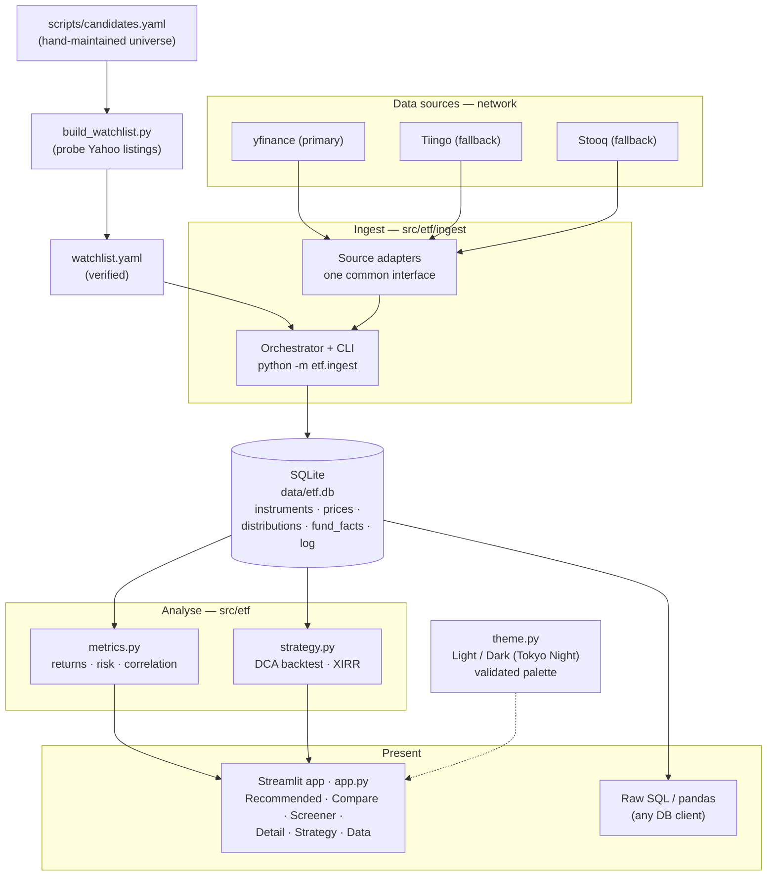

# ETF Comparison

A local, personal tool to gather, store, and compare **UCITS ETFs** (returns, cost, risk,
structure) to support buy-and-hold investing through Interactive Brokers. I made it for personal use (looking into investment options right now) and the thing is ~95% vibe-coded, so if you somehow happen upon this page - judge it as such.

The architecture is summarised in the [diagram below](#architecture); deeper working notes
live in a local, git-ignored `brain/` knowledge base.

## What it does

- **Ingests** end-of-day price history (+ dividends) for a watchlist of ~88 UCITS ETFs
  (across 15 categories) from Yahoo Finance, with Tiingo and Stooq as fallbacks, into a
  local **SQLite** database.
- **Computes** returns (trailing, CAGR, calendar-year, rolling), volatility (incl. rolling),
  Sharpe/Sortino, max drawdown, correlation, and DCA backtests — all total-return basis.
- **Presents** it in a themed **Streamlit** UI (switchable **Light / Dark** — a Tokyo Night
  palette) with a top nav and six pages:
  - **Recommended** — the three ETFs with the highest total return over the last 10 years
    (the app-wide default selection), a growth chart, and a 10-year leaderboard.
  - **Compare** — growth of 100, calendar-year & drawdown, risk-vs-return scatter,
    correlation heatmap, risk/return + trailing-return tables.
  - **Screener** — a risk-return map of the whole universe + a filterable table.
  - **Detail** — single-ETF price, monthly-return heatmap, rolling volatility/return.
  - **Strategy** — a dollar-cost-averaging backtest ("invest X/month for Y years") with
    final value, profit, money-multiple and XIRR.
  - **Data** — coverage/freshness and a one-click fetch.
- Keeps the raw data in a plain `.db` you can query with any SQL client.

The ETF universe is generated + verified against Yahoo by `scripts/build_watchlist.py`
(re-run it to extend the list). Charts use a colourblind-validated palette.

## Architecture

Local-first, single-user, and built as four clean layers — **ingest → store → analyse →
present**. Everything runs on your machine; the network is touched only during a deliberate
*fetch*. Prices land in one **SQLite** file you can open with any SQL client, and every
analytic (returns, risk, correlation, DCA) is computed on top of that raw layer — never
written back into it. A separate, self-correcting pipeline turns a hand-maintained candidate
list into a *verified* watchlist by probing which Yahoo listings actually return data.



Layer boundaries map to modules: `ingest/` (adapters + orchestration), `db.py` + `data.py`
(storage + queries), `metrics.py` + `strategy.py` (analytics), `app.py` + `theme.py` (UI).
Swapping a data source, adding a metric, or restyling the UI each touches exactly one layer.

## Setup

```powershell
.\.venv\Scripts\Activate.ps1        # venv is Python 3.13
pip install -e ".[dev]"             # installs the package + deps (also pytest, ruff)
```

Optional: copy `.env.example` to `.env` and add a free `TIINGO_API_KEY` (Yahoo works without
any key; Tiingo is used as a fallback where it has coverage).

## Usage

```powershell
# 1. Fetch data for everything in watchlist.yaml (creates data/etf.db)
python -m etf.ingest                 # full history
python -m etf.ingest --incremental   # only new rows since last run (faster)
python -m etf.ingest --only CSPX.L   # a single ETF
python -m etf.ingest --sources tiingo,yahoo,stooq   # change source priority

# 2. Launch the UI
streamlit run src/etf/app.py
```

Add/remove ETFs by editing [scripts/candidates.yaml](scripts/candidates.yaml) (each entry
lists candidate Yahoo tickers — `.DE` Xetra, `.L` London, `.AS` Amsterdam), then run
`python scripts/build_watchlist.py` to re-verify and regenerate `watchlist.yaml`.

## Raw data access

The database is a single file at `data/etf.db`. Query it directly:

```python
import pandas as pd, sqlite3
con = sqlite3.connect("data/etf.db")
pd.read_sql("SELECT * FROM prices WHERE isin = 'IE00B5BMR087'", con)
```

Or use the helpers in `etf.data` (`list_etfs`, `load_prices`, `price_matrix`, ...).

## Tests & lint

```powershell
pytest        # metrics unit tests
ruff check src tests
```

## Layout

- `src/etf/` — `config`, `db`, `data`, `metrics`, `strategy` (DCA), `theme`, `ingest/`
  (source adapters), `app.py` (UI).
- `scripts/build_watchlist.py` — regenerates/verifies `watchlist.yaml` from a candidate list.
- `data/etf.db` — local SQLite database (git-ignored, regenerable via ingest).
- `watchlist.yaml` — the ETFs to track (auto-generated).
- `tests/` — unit tests for the analytics and strategy layers.

## Stack

Python 3.13 · SQLite · pandas · yfinance (→ Tiingo/Stooq) · Streamlit + Plotly ·
streamlit-option-menu.
