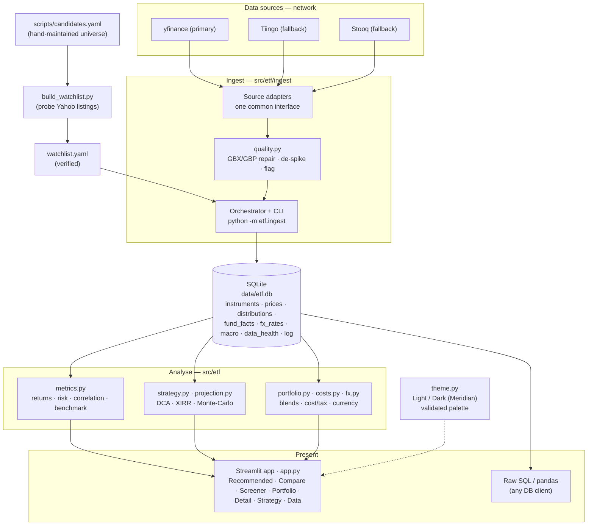

# ETF Comparison

A local, personal tool to gather, store, and compare **UCITS ETFs** (returns, cost, risk,
structure) and to *construct* buy-and-hold portfolios — blends, bonds & income, factor tilts,
a constrained optimiser, and a downside-risk engine — for investing through Interactive
Brokers. I made it for personal use (looking into investment options right now) and the thing
is ~95% vibe-coded, so if you somehow happen upon this page - judge it as such.

Built by [Sam Maliarov](https://www.linkedin.com/in/semyon-malyarov/) (attribution in-app is
text + monogram only, no photo).

The architecture is summarised in the [diagram below](#architecture); deeper working notes
live in a local, git-ignored `brain/` knowledge base.

## What it does

- **Ingests** end-of-day price history (+ dividends) for a watchlist of ~91 UCITS ETFs
  (across 15 categories, incl. equity factor sleeves and euro/German govt bonds) from Yahoo
  Finance, with Tiingo and Stooq as fallbacks, into a
  local **SQLite** database. **Data-quality repair is built into ingestion**: GBX/GBP
  (pence↔pounds) mis-denomination and isolated bad prints are auto-detected and fixed, and
  anything still suspect (e.g. an unadjusted split) is flagged rather than trusted.
- **Normalises currency**: the universe mixes EUR/GBP/GBp/USD/CHF; a Native/**EUR** toggle
  FX-converts everything for honest comparison and DCA (rates cached locally).
- **Computes** returns (trailing, CAGR, calendar-year, rolling), volatility, Sharpe/Sortino,
  max drawdown, correlation, DCA backtests, **benchmark-relative** metrics (beta, tracking
  error, information ratio, up/down capture), **rolling-window return distributions**, a
  **regime/stress lens**, and an all-in **cost & tax** model (IBKR commissions, tracking
  difference, spread/FX, EU dividend-tax drag, domicile notes) — all total-return basis.
- **Profiles the universe** with a researched **look-through** dataset (`etf/profiles.py` +
  a committed seed): every fund maps to the index it tracks, carrying region/country/GICS-sector
  weights, credit-quality (bonds), top-10 holdings, factor tilt and replication — **82 of 92
  funds** at full look-through, the rest left honestly partial (no invented weights). This
  feeds the optimiser's sector/region/asset-class constraints (with explicit *coverage*
  reporting). Also ingests the **Ken French European Fama/French-Carhart factor returns**
  (monthly) that power the regression-based factor exposures.
- **Presents** it in a themed **Streamlit** UI (switchable **Light / Dark** — the *Meridian*
  slate-navy / warm-paper palette with a teal accent) with a top nav and seven pages:
  - **Recommended** — selectable ranking (return / CAGR / CAGR-after-TER / Sharpe / Sortino
    / lowest drawdown), 5/10/15y lookback, per-category winners, and a market-context strip
    (US 10Y yield, VIX).
  - **Compare** — growth of 100, calendar-year & drawdown, risk-vs-return scatter,
    correlation heatmap, risk/return (incl. all-in cost & CAGR-after-cost) + trailing tables.
  - **Screener** — a risk-return map of the whole universe, a filterable/taggable table,
    favourites filter, and CSV export.
  - **Portfolio** — a full portfolio-construction desk:
    - **Blends** — build a weighted, periodically-rebalanced backtest (vs let-it-drift),
      blended metrics, low-correlation suggestions, lump-sum-vs-DCA, and a contribution-only
      **rebalancing assistant** (paste your holdings).
    - **Bonds · income** — for a bond fund, compare **distributions reinvested vs cashed out**
      (net-worth + cumulative-income paths), trailing-12-month yield, and the after-tax result
      under Dutch **Box 3 (2026 fictitious-return wealth tax)** *or* the postponed **2028
      actual-return** reform (both parameter sets sourced and configurable).
    - **Factor model** — pick MSCI World factor sleeves (value / momentum / quality / size /
      min-vol / multifactor), see each sleeve's additive contribution, the blend's **regression
      factor loadings** (betas / alpha / R² on the Ken French European FF-Carhart factors, read
      as relative tilts since those factors are USD-based), and a best/base/worst + market-crash
      purchasing-strategy scenario fan.
    - **Optimiser** — constrained mean-variance (**max-Sharpe / min-volatility**) solved with
      cvxpy + PyPortfolioOpt (Ledoit-Wolf covariance), with **leverage / shorting**,
      **turnover**, per-fund, and **sector/region/asset-class** limits (from the look-through
      profiles, with coverage reporting), plus the efficient frontier and which constraints
      bind. Carries a Michaud estimation-sensitivity caveat.
    - **Risk** — **VaR & CVaR** at 95/99% by historical, parametric-Gaussian, Cornish-Fisher
      (fat-tail) and Monte-Carlo methods with √t horizon scaling; **contribution-to-risk** per
      holding (Euler allocation); and **historical stress replays** of seven dated crash windows
      (GFC 2008 → SVB 2023) on the current weights, with honest caveats and explicit coverage.
  - **Detail** — price, monthly-return heatmap, rolling vol/return, cost & tax panel,
    benchmark-relative + regime + any-window-returns panels, a **strategy & exposure
    look-through** view (region/sector/credit bars, top countries & holdings, Full/Partial
    flag), an opt-in local **sentiment** read, fund fact-sheet download, and a persisted
    favourite/tag.
  - **Strategy** — a DCA backtest (net of commissions/FX) **plus a forward projection**
    (OLS trend or Monte-Carlo/bootstrap fan) of net worth up to 40 years.
  - **Data** — coverage/freshness, a data-health report, staleness flags, a universe-level
    **profile-coverage** panel (profiled / full / partial), and a fetch button.
- Keeps the raw data in a plain `.db` you can query with any SQL client.

The ETF universe is generated + verified against Yahoo by `scripts/build_watchlist.py`
(re-run it to extend the list; it auto-drops tickers that fail verification repeatedly).
Charts use a colourblind-validated palette. Preferences and tags persist between sessions.

## Architecture

Local-first, single-user, and built as four clean layers — **ingest → store → analyse →
present**. Everything runs on your machine; the network is touched only during a deliberate
*fetch*. Prices land in one **SQLite** file you can open with any SQL client, and every
analytic (returns, risk, correlation, DCA) is computed on top of that raw layer — never
written back into it. A separate, self-correcting pipeline turns a hand-maintained candidate
list into a *verified* watchlist by probing which Yahoo listings actually return data.



Layer boundaries map to modules: `ingest/` (adapters + orchestration), `db.py` + `data.py`
(storage + queries), `metrics.py` + `strategy.py` (analytics), `app.py` + `theme.py` (UI).
Swapping a data source, adding a metric, or restyling the UI each touches exactly one layer.

## Setup

```powershell
.\.venv\Scripts\Activate.ps1        # venv is Python 3.13
pip install -e ".[dev]"             # installs the package + deps (also pytest, ruff)
```

Optional: copy `.env.example` to `.env` and add a free `TIINGO_API_KEY` (Yahoo works without
any key; Tiingo is used as a fallback where it has coverage).

## Usage

```powershell
# 1. Fetch data for everything in watchlist.yaml (creates data/etf.db)
python -m etf.ingest                 # full history (repairs + FX rates included)
python -m etf.ingest --incremental   # only new rows since last run (faster)
python -m etf.ingest --only CSPX.L   # a single ETF
python -m etf.ingest --sources tiingo,yahoo,stooq   # change source priority
python -m etf.ingest --if-stale 7    # only fetch if data >7 days old (scheduled job)
python -m etf.ingest --repair        # re-run data-quality repair, no network
python -m etf.ingest --fx            # backfill quote currencies + EUR FX rates
python -m etf.ingest --facts         # backfill AUM/inception + macro (10Y yield, VIX)
python -m etf.ingest --factors-ken   # fetch Ken French European FF5+momentum factor returns

# 2. Launch the UI
streamlit run src/etf/app.py
```

For an unattended weekly refresh, point Windows Task Scheduler / cron at
`python -m etf.ingest --if-stale 7`.

Add/remove ETFs by editing [scripts/candidates.yaml](scripts/candidates.yaml) (each entry
lists candidate Yahoo tickers — `.DE` Xetra, `.L` London, `.AS` Amsterdam), then run
`python scripts/build_watchlist.py` to re-verify and regenerate `watchlist.yaml`.

## Raw data access

The database is a single file at `data/etf.db`. Query it directly:

```python
import pandas as pd, sqlite3
con = sqlite3.connect("data/etf.db")
pd.read_sql("SELECT * FROM prices WHERE isin = 'IE00B5BMR087'", con)
```

Or use the helpers in `etf.data` (`list_etfs`, `load_prices`, `price_matrix`, ...).

## Tests & lint

```powershell
pytest        # metrics unit tests
ruff check src tests
```

## Layout

- `src/etf/` — `config`, `db`, `data`, `quality` (data-quality repair), `fx` (currency
  normalisation), `costs` (cost & tax model), `metrics`, `strategy` (DCA), `projection`
  (forward projections), `portfolio` (blends + rebalancing), `bonds` (reinvest-vs-cash-out
  income), `tax` (Dutch Box-3 / actual-return), `profiles` (ETF look-through + exposure
  aggregation), `factors` (regression exposures + scenario fan), `optimizer` (constrained
  mean-variance), `risk` (VaR/CVaR + stress), `sentiment` (local scorer), `settings` (persisted
  prefs), `theme` (Meridian Light/Dark), `ingest/` (source adapters, incl. `kenfrench`),
  `app.py` (UI).
- `scripts/build_watchlist.py` — regenerates/verifies `watchlist.yaml`; auto-drops tickers
  that fail verification repeatedly (`scripts/failures.yaml` ledger, git-ignored).
- `data/etf.db` — local SQLite database (git-ignored, regenerable via ingest). Also holds
  `data_health`, `fx_rates`, `macro_series`; `data/settings.json` stores UI preferences.
- `watchlist.yaml` — the ETFs to track (auto-generated).
- `tests/` — unit tests for analytics, quality, FX, costs, projections, portfolio, bonds,
  tax, profiles, factors, optimiser, risk, sentiment and robustness, plus data-integrity
  invariants, WCAG-AA theme-contrast checks, and UI/theme smoke tests (both themes and both
  currency modes).

## Stack

Python 3.13 · SQLite · pandas / numpy · yfinance (→ Tiingo/Stooq) · PyPortfolioOpt / cvxpy
(portfolio optimiser) · Streamlit + Plotly · streamlit-option-menu.
